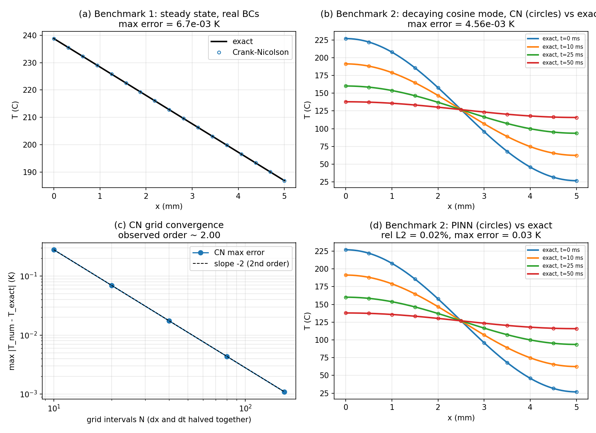

# Analytical validation of the solver and the PINN

**TL;DR:** Per Frankel's request, both the Crank–Nicolson reference solver and the PINN are now
validated against problems with exact closed-form solutions. The CN solver matches the exact
answers to within a few mK and shows textbook second-order grid convergence (observed order
2.00). The PINN, trained on a benchmark with a known exact solution, recovers it to **0.02%
relative L₂ error (max 0.03 K)**. Both implementations are correct; we can trust them on the
main problem. Reproduce with `PYTHONPATH=src python analytical_validation.py`.

---

## Why this exists

The whole project rests on two pieces of software we wrote ourselves: the Crank–Nicolson
solver (our ground truth) and the PINN (our model). Until now, neither had been checked against
anything *outside our own code*. Frankel asked for exactly this in the last meeting: validate
CN against an analytical solution, and validate the PINN on a test case with a known exact
solution, before trusting either on the rocket problem.

The full problem (sinusoidal flux + convection) has no closed-form solution — that's why we use
CN at all. So the standard approach is to pick simplified sibling problems that *do* have exact
answers and show our code reproduces them. Two benchmarks together cover everything:

| | Tests | Exact solution |
|---|---|---|
| **Benchmark 1** — steady state, constant flux, real BCs | spatial discretization + our actual Neumann/Robin ghost-point BCs | linear profile |
| **Benchmark 2** — decaying cosine mode, insulated slab | time-stepping (CN) and the full PINN implementation | single decaying Fourier mode |

## Benchmark 1: steady state with the real boundary conditions

Set the flux amplitude to zero (constant `q = q_base`) and run long enough to reach steady
state. Then ∂T/∂t = 0, so the heat equation reduces to d²T/dx² = 0 → a straight line. The two
boundary conditions fix it completely. At x = L, the flux q leaving into the coolant gives
`T(L) = T_cool + q/h_cool`; the constant flux through the wall gives slope `−q/k`. So:

```
T(x) = T_cool + q/h_cool + q·(L − x)/k
```

**Result:** CN at steady state matches this to **max error 6.7×10⁻³ K** (on a ~170 K
temperature range — i.e. discretization-level dust). This confirms the spatial scheme *and*
the ghost-point implementation of both real BCs. — Fig. panel (a).

## Benchmark 2: decaying cosine mode (transient)

Benchmark 1 can't test the time-stepping (it's steady by construction). For that, take an
insulated slab: `q_hot = 0` and `h_cool = 0`, i.e. zero flux on both faces — which our existing
BC code produces just by setting those config values to zero. Start from a cosine profile:

```
T(x,0) = T_mean + A·cos(πx/L)
```

Separation of variables: cos(nπx/L) are exactly the eigenfunctions of the insulated slab (their
slope is zero at both faces, so the BCs are satisfied automatically), and each mode decays as a
pure exponential. With a single mode the solution stays a cosine forever and just shrinks:

```
T(x,t) = T_mean + A·cos(πx/L)·exp(−α(π/L)²·t)
```

We used T_mean = 400 K, A = 100 K. The decay rate is α(π/L)² ≈ 44 s⁻¹, so over t_final = 50 ms
the mode decays to ~11% of its initial amplitude — a genuinely transient test.

**CN result:** max error **4.6×10⁻³ K** over the whole space–time field (relative L₂ ≈ 8×10⁻⁵).
— Fig. panel (b).

**Grid convergence:** halving dx and dt together should cut the error ~4× each time if the
scheme is really second order in both. It does, exactly:

| N (intervals) | max error (K) | observed order |
|---:|---:|---:|
| 10 | 2.79×10⁻¹ | — |
| 20 | 6.97×10⁻² | 2.00 |
| 40 | 1.74×10⁻² | 2.00 |
| 80 | 4.36×10⁻³ | 2.00 |
| 160 | 1.09×10⁻³ | 2.00 |

Observed order 2.00 is the fingerprint of a correctly implemented Crank–Nicolson scheme —
a subtle bug (especially in the BC ghost points) typically degrades this toward first order.
— Fig. panel (c).

## PINN validation on Benchmark 2

Same physics setup, but now solved by the PINN instead of finite differences, using the repo's
own network (`model.py`) and the repo's own PDE + boundary losses (`losses.py` — with q = 0 and
h_cool = 0 they enforce the zero-flux BCs automatically). The only benchmark-specific piece is
the initial-condition target, which becomes θ(x̂,0) = 1 + cos(πx̂) instead of a constant. In
nondimensional variables the exact solution is:

```
θ(x̂, t̂) = 1 + cos(πx̂)·exp(−β·π²·t̂)
```

Trained to convergence (5000 Adam epochs + LBFGS polish — following the undertraining finding
in `baseline_error_findings.md`, validation runs must be converged to be meaningful):

**PINN result: relative L₂ = 0.02%, max error = 0.03 K** against the exact solution.
— Fig. panel (d).

This says the PINN machinery — the network, the autograd PDE residual, the flux boundary
losses, and the training loop — correctly solves a heat-conduction problem when given enough
training. Combined with the CN validation above, both halves of our pipeline now rest on
something outside our own code.



## What this gives the final report

- The two validation sections Frankel explicitly asked for (CN appendix + PINN test case),
  ready to convert into the AIAA appendix.
- A quantitative credibility statement for the Methods section: solver verified to O(mK)
  against exact solutions with observed order 2.00; PINN verified to 0.02% on a known-solution
  benchmark.
- Together with the undertraining finding: any error we see on the main problem is now
  attributable to training budget / problem difficulty, not implementation bugs.

## Files

- `analytical_validation.py` — self-contained script (both benchmarks + convergence study +
  PINN training). Run from the repo root: `PYTHONPATH=src python analytical_validation.py`.
  Takes a few minutes (the PINN training is the slow part).
- `analytical_validation.png` — the four-panel figure above.
