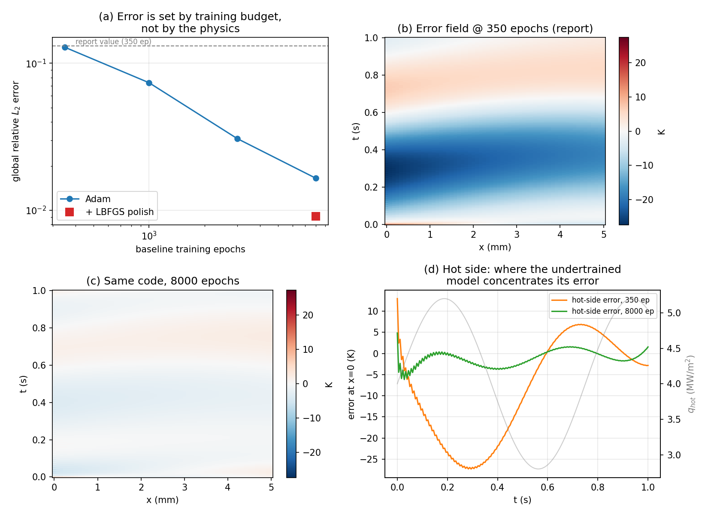

# Baseline PINN error — root cause

**TL;DR:** The baseline's ~13% error is **not a bug**. It's undertraining. Our `progress`
config stops the baseline at 350 epochs, which is a small fraction of what it needs. Train
longer and the error drops smoothly toward ~1%, with no code changes. The catch: our headline
adaptive result was measured against that undertrained baseline, so we need to rerun both arms
at convergence before the final report.

---

## How the error is measured

`evaluate.py` runs the trained PINN on the exact same (x, t) grid as the Crank–Nicolson
reference, converts back to Kelvin, and subtracts: `error = T_pred − T_ref`. From that it
reports global relative L₂ (our 0.1312) and hot-side max error (our 27.5 K). Reproduce with:

```bash
PYTHONPATH=src python scripts/run_experiment.py --mode progress
```

I first checked the reference solver itself against an **analytical steady-state solution**
(constant flux, long time). It matched to **0.007 K**, so the yardstick is correct — the error
is genuinely the PINN's, not the ground truth's.

## The finding: error is a function of training length

Same code, same seed, **only the epoch count changed**:

| Baseline epochs | Global rel. L₂ | Hot-side max error |
|---:|---:|---:|
| 350 (our current config) | 12.8% | 27.3 K |
| 1000 | 7.4% | 13.9 K |
| 3000 | 3.1% | 6.6 K |
| 8000 | 1.7% | 6.2 K |
| 8000 + LBFGS polish | 0.9% | 4.6 K |

(First and third rows are the ones easiest to reproduce locally — see `check_fix.py`.)



**Why this proves it's undertraining and not a physics bug:** a real bug — wrong sign, bad
nondimensionalization, wrong BC — would make the error *plateau at a wrong answer* no matter
how long we train. Ours doesn't. It marches steadily down as we train longer (panel a). The
equations are right; the optimizer was just cut off early.

**Where the error lives while undertrained:** the 350-epoch error is a smooth cold bias hugging
the hot wall (panels b, d) — it's the **flux boundary condition**, the hardest term because it
constrains a derivative against a time-varying sinusoid. The loss history agrees: the BC term
dominates from epoch 1 and is the slowest to fall. This is the standard soft-BC pathology
(competing PDE-vs-BC gradients). At 8000 epochs that structure is gone (panel c).

**Why the config was set this way:** almost certainly runtime — `progress` mode was tuned to
make the three-seed study fast. Reasonable for a milestone, just not a converged baseline.

## What this means for us

1. **The baseline fix is config-level, not a rewrite.** Bump `baseline_epochs` in `config.py`
   (the `progress` preset sets it to 350). At least 3000; the error keeps improving past that,
   so we should pick based on the accuracy/runtime we want for final figures. An optional LBFGS
   polish after Adam gets us under 1% cheaply.

2. **Our adaptive improvement (0.131 → 0.069) was measured against an undertrained baseline.**
   Some of that gain is sensors compensating for a weak baseline. Once the baseline is converged
   to ~1–3%, the adaptive margin will shrink. That's fine — "adaptive assimilation still helps a
   *converged* baseline, by this much" is a far more defensible claim than a big number against a
   weak strawman, and it's exactly the kind of comparison a reviewer would trust. But **both arms
   must be rerun against the converged baseline** before the final AIAA writeup, and the
   per-window update budget becomes a live tradeoff again.

## Suggested next step

Change `baseline_epochs` for the final runs, rerun baseline **and** adaptive at that setting,
and regenerate the comparison table/figures. If we want, add LBFGS as a final polish stage. I'm
happy to own the re-run and the before/after write-up for the results section.
